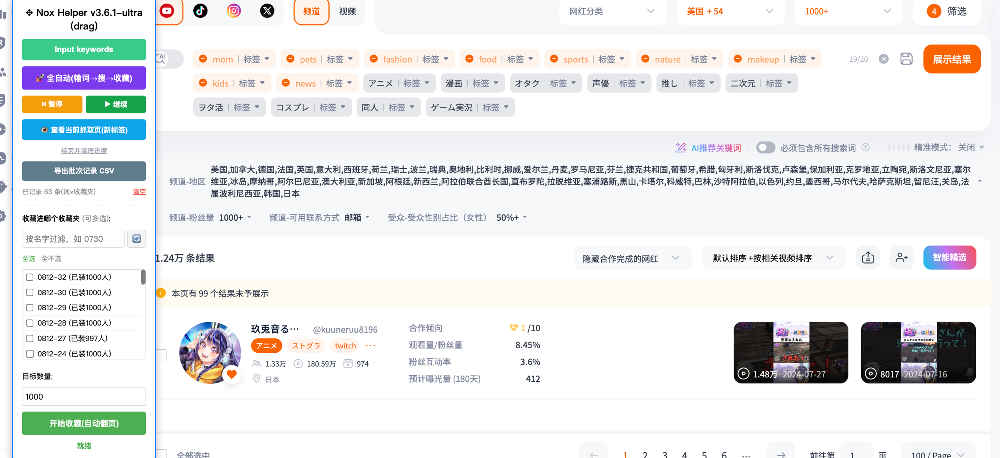
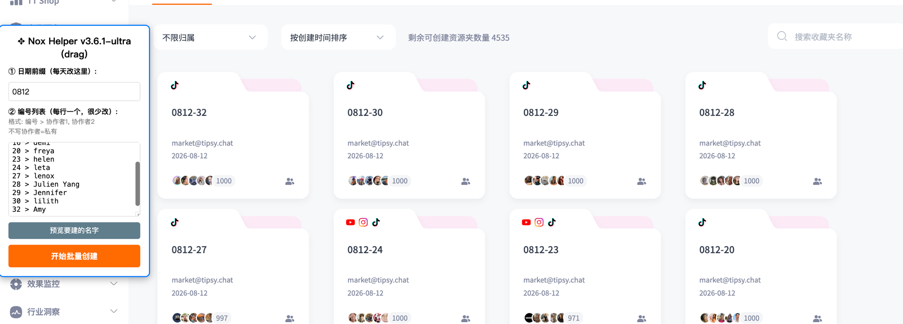
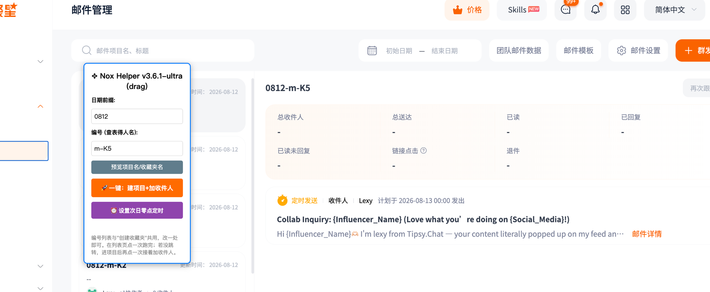
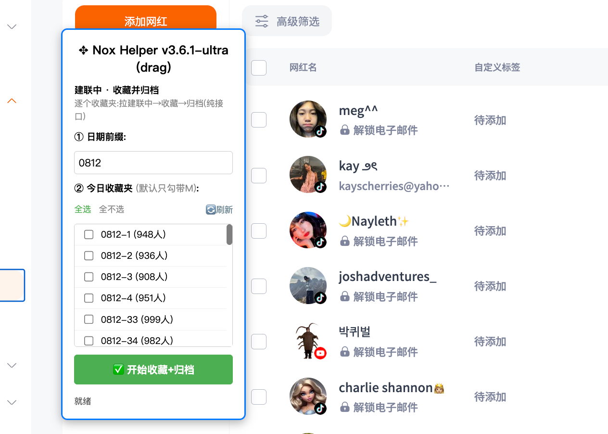

# Nox Ultra

### ▶ [点此安装脚本](https://github.com/kevendeng/nox-ultra-/raw/main/nox-ultra.user.js)（需先装 [Tampermonkey](https://www.tampermonkey.net/)，点开自动弹出安装）

一个用于 **NoxInfluencer** 的油猴脚本，把每天重复的达人建联工作（搜索收藏、建收藏夹、发邮件、CRM 归档）做成一键式的可视化面板。

装好后进入 NoxInfluencer 对应页面，右侧会自动浮出操作面板。

---

## 功能一览

### 1. 搜索页 · 全自动收藏

在搜索页填入关键词，选好目标收藏夹和目标数量，点 **🚀 全自动**，脚本自动完成：输词 → 搜索 → 跨平台（YouTube / TikTok / Instagram / X）翻页 → 逐个收藏进指定收藏夹。

- **进度可控**：随时 ⏸ 暂停 / ▶ 继续，进度自动保留，不用从头再来。
- **已建联的自动跳过**：已经联系过的达人不会被重复收藏。
- **👁 查看当前抓取页**：一键在新标签打开脚本正在处理的那一页，随时核对。
- **批次记录**：每次收藏（关键词 × 收藏夹）自动记账，可一键 **导出 CSV**。

### 2. 收藏夹 · 批量创建

按当天日期前缀 + 编号列表，一次性批量创建一整天要用的收藏夹。

- 填「日期前缀」和「编号列表」，格式 `编号 > 协作者1, 协作者2`（不写协作者即为私有）。
- **预览** 要建的名字，确认无误再 **开始批量创建**。
- 面板显示剩余可创建资源夹数量。

### 3. 邮件 · 建项目 + 定时发送

把「建邮件项目 → 添加收件人 → 设定发送时间」合并成一步。

- 填「日期前缀」和「编号」，**预览** 项目名/收藏夹名。
- **🚀 一键：建项目 + 加收件人**。
- **🕛 一键设置次日零点定时发送**，当天排好、次日自动发出。

### 4. CRM · 收藏并归档

处理「建联中」的达人：逐个收藏夹自动完成「拉取建联中 → 收藏 → 归档」。

- 选好当天日期前缀和要处理的收藏夹（默认只勾带 M 的）。
- 点 **✅ 开始收藏 + 归档**，脚本自动跑完，面板实时显示进度。

---

## 安装

1. 浏览器安装 [Tampermonkey](https://www.tampermonkey.net/)（油猴）扩展。
2. 打开 `nox-ultra.user.js`，油猴会提示安装，确认即可。
3. 打开 NoxInfluencer 对应页面，右侧出现操作面板即安装成功。

> 更新脚本后记得在油猴里重新安装最新版本。
